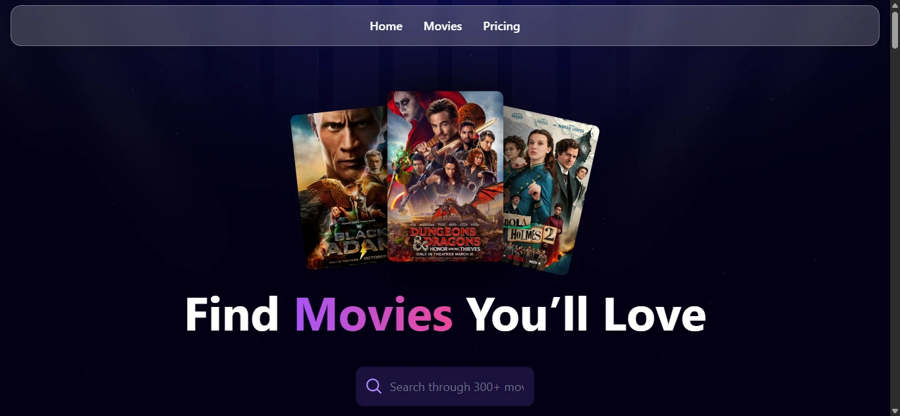
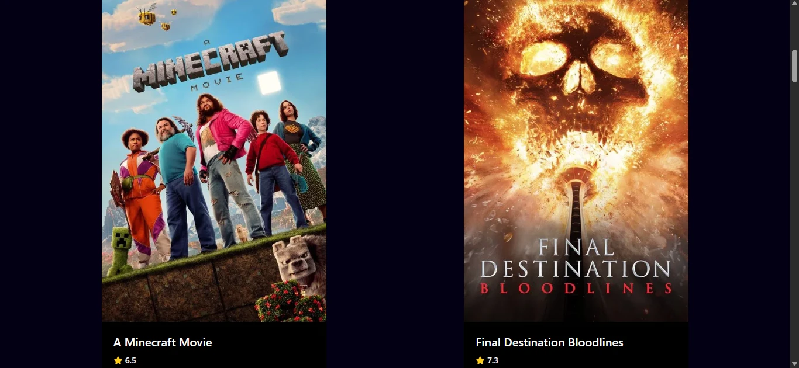
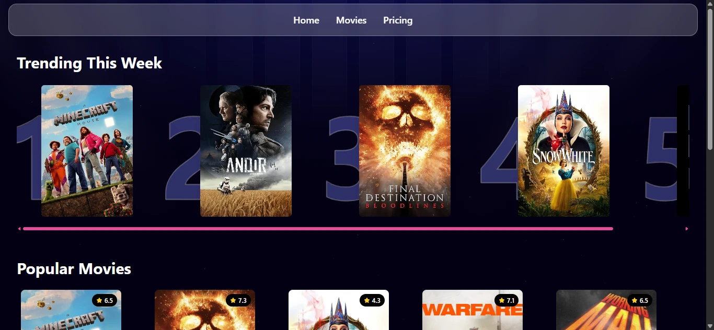
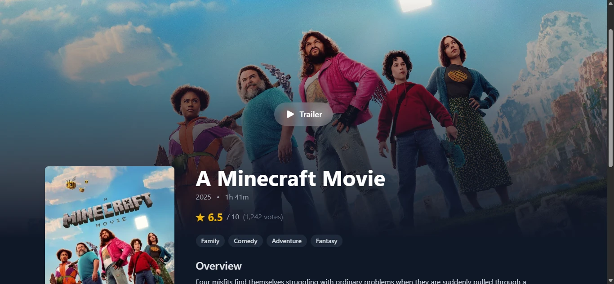
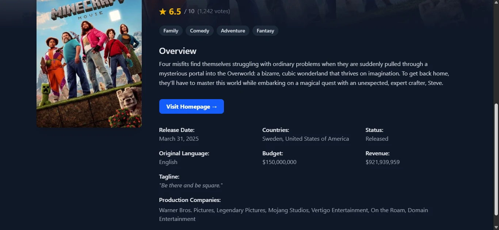
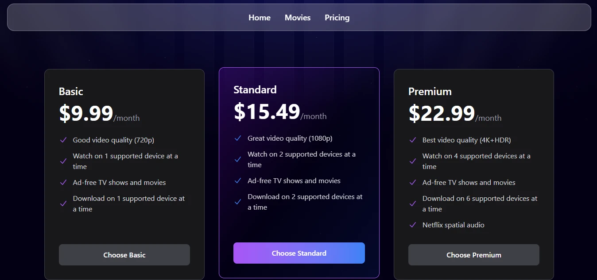

# Movie App

## Overview

Movie App is a responsive React frontend project that displays detailed movie information powered by TMDB API. It showcases modern web development practices and my skills as a web developer in my portfolio.

## Features

- Responsive design built with Tailwind CSS.
- Browse popular movies and TV shows.
- Detailed movie pages with trailers, ratings, and production info.
- Search functionality to find movies quickly.
- Trending section with sleek animations and interactive navigation.
- Clean and intuitive UI design.

## Technologies Used

- React
- React Router DOM
- Tailwind CSS
- Vite
- JavaScript (ES6+)

## Screenshots

Homepage

 Movies on Homepage

 Movies Page

 Movie Details Page

 Pricing Page

## Live Demo

Check out the live demo at [Movie App Demo](https://movie-app-omega-five-96.vercel.app/)
