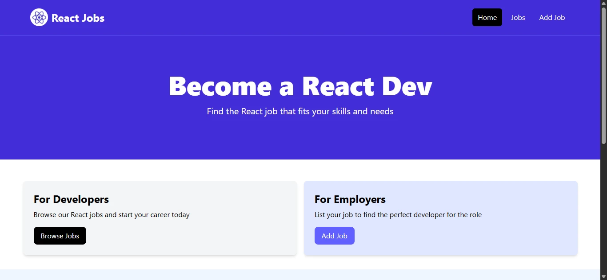
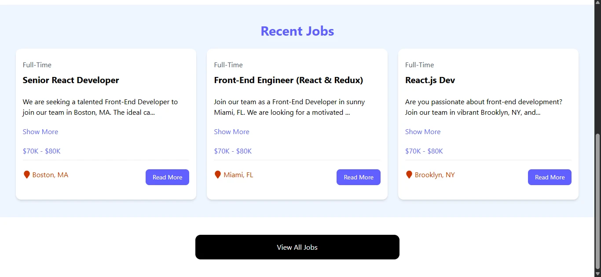
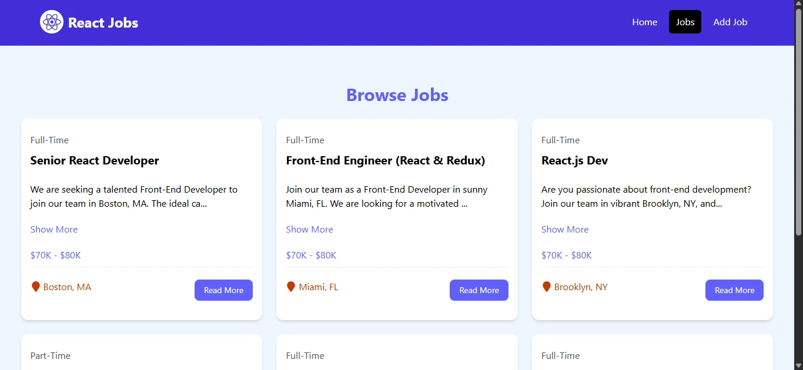
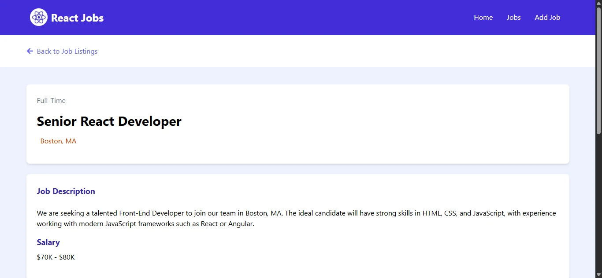
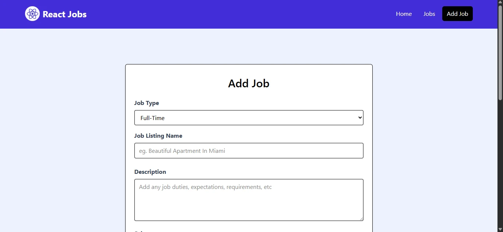

# React Job Listing Website

## Overview

React Job Listing is a modern, responsive static website built with React. This project is part of my portfolio and showcases my skills in building interactive and user-friendly web applications.

## Features

- **Job Listings:** Browse and view detailed job opportunities.
- **Dynamic Routing:** Seamless navigation between the home page, job details, and add job form.
- **Responsive Design:** Designed with Tailwind CSS for an optimal experience on all devices.
- **Interactive UI:** Expandable job description and user notifications via toast alerts.

## Technologies Used

- React
- React Router DOM
- Tailwind CSS
- Vite
- React Icons
- React Toastify

## Screenshots

Home Page

Jobs Listing Page

Job Details Page

Add Job Form

## Live Demo

[Live Demo Link](REPLACE_WITH_YOUR_LINK)
