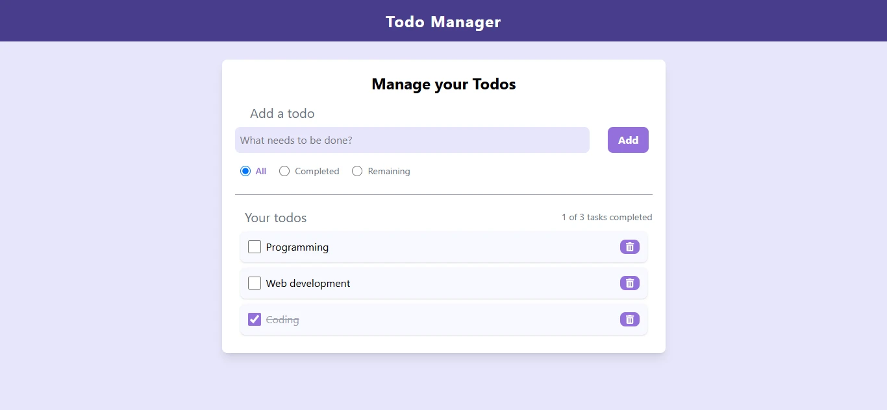

# Todo App

## Overview

A minimalist yet fully functional Todo App built with React and Vite, showcasing my front-end development skills. This project demonstrates clean design, responsive layouts, and efficient state management using localStorage.

## Features

- Add, delete, and toggle todos
- Filter todos by all, completed, or remaining
- Responsive design using Tailwind CSS
- Persistent state with localStorage

## Technologies Used

- **React**
- **Vite**
- **Tailwind CSS**
- **JavaScript (ES6+)**

## Screenshots

## Live Demo

[View Live Demo](https://todo-app-one-alpha-55.vercel.app/)
